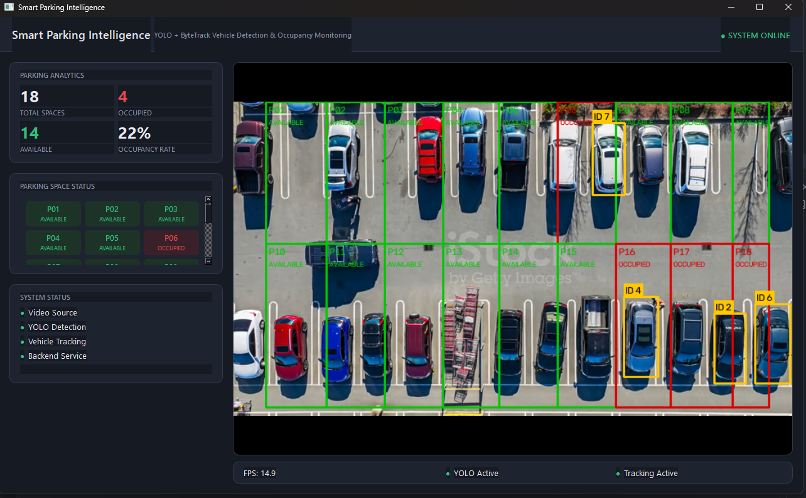

# Smart Parking YOLO

A local computer-vision application that watches a parking-lot video, detects and tracks vehicles with YOLO, and reports which individual parking spaces are occupied in a live desktop dashboard.

## Overview

The system reads a parking-lot video, detects vehicles frame by frame, tracks them across frames, and associates each detection with a specific, mapped parking space. Occupancy status and analytics update live in a PySide6 dashboard, backed by a small FastAPI service layer.

## Features

- YOLO vehicle detection (Ultralytics, aerial-imagery model)
- ByteTrack multi-object tracking with persistent vehicle IDs
- Per-space parking occupancy detection (not just a vehicle count)
- FastAPI backend exposing live system state
- PySide6 desktop GUI with live annotated video
- Real-time parking analytics (total / occupied / available / occupancy rate)

## Demo / Preview



## Architecture

```
Parking Video
      |
      v
YOLO Detection
      |
      v
ByteTrack
      |
      v
Parking Occupancy
      |
      v
FastAPI
      |
      v
PySide6 GUI
```

## Tech Stack

- Python
- Ultralytics YOLO
- ByteTrack
- OpenCV
- FastAPI
- PySide6
- Pytest

## Project Structure

```
smart-parking-yolo/
├── src/            # detection, tracking, parking, backend, gui, utils modules
├── config/         # settings, parking-space polygons, tracker config
├── tests/          # pytest unit tests
├── scripts/        # phase verification / debug scripts
├── docs/           # video analysis & model selection notes
├── images/         # dashboard preview image
├── outputs/        # sample screenshots
├── main.py         # application entry point
└── requirements.txt
```

## Installation

```bash
python -m venv venv
venv\Scripts\activate
pip install -r requirements.txt
```

The YOLO weights are downloaded automatically by Ultralytics on first run.

## Run

```bash
python main.py
```

This starts the CV pipeline, the FastAPI backend (`http://127.0.0.1:8000`), and opens the GUI.

## Testing

```bash
pytest tests/ -v
```

26 tests currently pass, covering video I/O, detection, tracking, occupancy logic, and the API.

## Notes / Limitations

- The detector is a pretrained aerial-imagery model (not fine-tuned on this exact scene), so recall on a few specific vehicles is imperfect — documented in `docs/model_notes.md`.
- Parking-space polygons in `config/parking_spaces.json` are calibrated to the included sample video's camera position.
- Inference runs on CPU in this environment; a CUDA-capable GPU would run faster if available.

## License

This project is licensed under the [MIT License](LICENSE). It uses [Ultralytics YOLO](https://github.com/ultralytics/ultralytics) (AGPL-3.0) and ByteTrack, both third-party technologies not authored by this project. The included sample video is stock footage used for local development and demonstration only.
